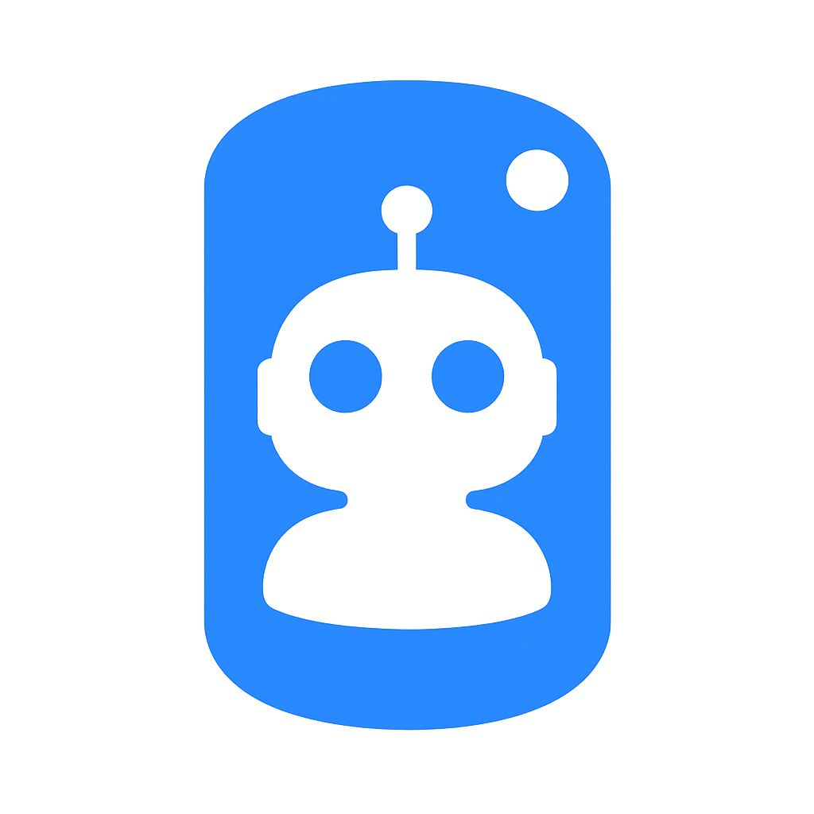
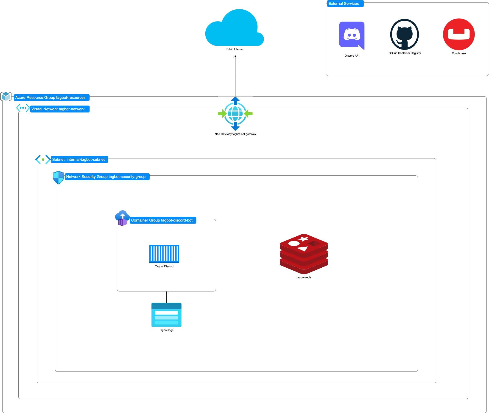

```                                                                                               
8888888 8888888888   .8.           ,o888888o.    8 888888888o       ,o888888o. 8888888 8888888888 
      8 8888        .888.         8888     `88.  8 8888    `88.  . 8888     `88.     8 8888       
      8 8888       :88888.     ,8 8888       `8. 8 8888     `88 ,8 8888       `8b    8 8888       
      8 8888      . `88888.    88 8888           8 8888     ,88 88 8888        `8b   8 8888       
      8 8888     .8. `88888.   88 8888           8 8888.   ,88' 88 8888         88   8 8888       
      8 8888    .8`8. `88888.  88 8888           8 8888888888   88 8888         88   8 8888       
      8 8888   .8' `8. `88888. 88 8888   8888888 8 8888    `88. 88 8888        ,8P   8 8888       
      8 8888  .8'   `8. `88888.`8 8888       .8' 8 8888      88 `8 8888       ,8P    8 8888       
      8 8888 .888888888. `88888.  8888     ,88'  8 8888    ,88'  ` 8888     ,88'     8 8888       
      8 8888.8'       `8. `88888.  `8888888P'    8 888888888P       `8888888P'       8 8888       

```
<p align="center">


</p>

## 📍Table of Contents
* 👋 [Overview](#-overview)
* ✅ [Dependencies](#-dependencies)
* 🌵 [File Structure](#-file-structure)
* 💾 [Data](#-data)
* 🏃 [Preliminary Steps](#-preliminary-steps)
* 🔧 [Environment Variables](#-environment-variables)
* 🚀 [Getting Started](#getting-started)
* 📚 [Discord Bot Commands](#-discord-bot-commands)
* 🎮 [Supported Platforms](#-supported-platforms)
* 🚀 [Deploy](#-deploy)
* 🔧 [Troubleshooting](#-troubleshooting)
* 🤝 [Contribute](#contribute)
* 🚨 [Security Issues](#-security-issues)
* 🗺️ [Roadmap](#-resources)


## 👋 Overview
🎮 Tired of chasing down gamer tags before your match? Or waiting scrolling through your messages for your competitors tag?! Well meet Tagbot, your new Discord sidekick for online FGC tournaments.


🔥 Meet Tagbot , your new Discord sidekick for online FGC tournaments.
It grabs your opponent's tag instantly, so you can stop waiting and start playing.


[](https://www.linkedin.com/in/zuri-hunter-748ba514)
[](https://x.com/ZuriHunter)
[](https://github.com/thestrugglingblack)

<p align="center">
  
</p>

## ✅ Dependencies
* Couchbase DB
* Redis DB
* Python v3
* Discord
* Docker

## 🌵 File Structure
```tree
├── CHANGELOG.md
├── Dockerfile
├── README.md
├── bot
│   └── tagbot.py
├── contribute
│   ├── CONTRIBUTE.md
│   └── PULL_REQUEST_TEMPLATE.md
├── db
│   ├── couchbasedb.py
│   └── redisdb.py
├── docker-compose.yml
├── env.template
├── logs
│   └── tagbot-application.log
├── requirements.txt
├── run.py
├── site
│   ├── README.md
│   ├── app
│   ├── components
│   ├── eslint.config.mjs
│   ├── next-env.d.ts
│   ├── next.config.ts
│   ├── package.json
│   ├── postcss.config.mjs
│   ├── public
│   ├── tailwind.config.js
│   ├── tsconfig.json
│   └── utils
├── terraform
│   ├── main.tf
│   ├── network.tf
│   ├── outputs.tf
│   ├── redis.tf
│   ├── site.tf
│   ├── tagbot.tf
│   └── variables.tf
├── test
│   ├── test_couchbasedb.py
│   ├── test_get_prefix.py
│   ├── test_redisdb.py
│   └── test_tagbot.py
└── utils
    ├── check_env.py
    ├── default_msg.py
    ├── get_prefix.py
    └── logger.py
```

## 💾 Data
The data is stored in a NoSQL database called Couchbase. Each entry follows this format.
```json
"DISCORD_USER_ID": {
  "psn":""
  "wb": "",
  "tekken": "",
  "sf": "",
  "steam": "",
  "xbox": ""
}
```

## 🏃 Preliminary Steps
### Setup Python Environment
```bash
python -m venv .venv

source .venv./bin/activate

pip install -r requirements.txt
```

### Install Website Dependencies
```bash
nvm use

npm install
```

## 🔧 Environment Variables
Copy `.env.template` to `.env` and configure:

| Variable               | Description | Required |
|------------------------|-------------|----------|
| DISCORD_TOKEN          | Your Discord bot token | Yes |
| DISCORD_APPLICATION_ID | Your Discord Application ID | Yes |
| DISCORD_PUBLIC_ID      | Your Discord Public ID | Yes|
| DISCORD_IMAGE          | Your Discord Logo URL | No |
| COUCHBASE_CONNECTION   | Couchbase connection string | Yes |
| COUCHBASE_USERNAME     | Couchbase username string | Yes |
| COUCHBASE_PASSWORD     | Couchbase password string | Yes |
| COUCHBASE_BUCKET       | Couchbase bucket name string | Yes |
| COUCHBASE_COLLECTION   | Couchbase collection name string | Yes |
| COUCHBASE_SCOPE        | Couchbase scope string | Yes |
| REDIS_HOST             | Redis connection string | Yes |
| REDIS_PORT | Redis Port integer | Yes|
| REDIS_PASSWORD | Redis password string | Yes |
|REDIS_SSL | Redis SSL settings boolean | Yes |


## 🚀 Getting Started
### Components
- **Discord Bot**: Handles Discord interactions (`bot/tagbot.py`)
- **Website**: Next.js frontend for providing information about the bot (`site/)
- **Databases**: Couchbase for data storage, Redis for caching
- **Infrastructure**: Terraform for Microsoft Azure

### Discord Bot
#### Code Style
To lint all the python files run `black .`

#### Unit test
To run all unit test for the bot run `pytest`

#### Launch Bot
To run the Discord bot `python run.py`

### Website
#### Code Style 
To lint all javascript files run `npm run lint`

#### Launch Website
To run the website run `npm run dev` and go to http://localhost:3000

#### Production Files
To generate production files for the website run `npm run build`. The output of those files will be in `/out` directory.

## 📚 Discord Bot Commands
| Command       | Description                                                          | Usage                          | Example                              | Permissions |
|---------------|----------------------------------------------------------------------|--------------------------------|--------------------------------------|-------------|
| `add`         | Set your gaming tag for a specific platform                          | `!tagbot add <platform> <tag>` | `!tagbot add psn thestrugglingblack` | User        |
| `tag`         | Get a user's gaming tags                                             | `!tagbot tag <@user>`          | `!tagbot tag @thestrugglingblack`    | User        |
| `healthcheck` | View the health status of Tagbot                                     | `!tagbot healthcheck`          | `!tagbot healthcheck`                | User        |
| `list`        | List all supported gaming platforms                                  | `!tagbot list`                 | `!removetag psn`                     | User        |
| `support`     | List information in getting in contact with the developers of TagBot | `!tagbot support`              | `!tagbot support`                    | User        |
| `commands`    | List all commands for TagBot                                         | `!tagbot commands`             | `!tagbot commands`                   | User        |

## 🎮 Supported Platforms
| Tag | Platform Name       |
|-----|---------------------|
|`psn`| PlayStation Network |
|`wb`| Warner Bros Games   |
|`xbox`| Xbox Live           |
|`steam`| Steam             |
|`sf` | Street Fighter      |
|`tekken` | Tekken              |

## 🚀 Deploy
TagBot is deployed on Microsoft Azure using Infrastructure as Code (Terraform) with automated CI/CD pipelines.

<p align="center">
  
</p>

### Infrastructure Overview
The application uses the following Azure services:
- **Azure Container Instances** : hosts the Discord bot
- **Azure Static Web Apps**: hosts Next.js website for the bot
- **Azure Cache for Redis**: caching and session storage
- **Azure Storage Account**: store the application logs and Terraform state management

### Prerequisites
- Azure CLI
- Terraform
- Azure Subscription
- GitHub Action Secrets

### Setup
Log in to Azure CLI

```bash
export ARM_SUBSCRIPTION_ID=$(az account show --query id --output tsv)
export ARM_TENANT_ID=$(az account show --query tenantId --output tsv)

az login
```

Create a `resource group`.

```bash
az group create --name tagbot-resources --location "East US"
```

Create a `storage account` for terraform state files and container logs.

``` bash
az storage account create \
  --name tagbottfstate \
  --resource-group tagbot-resources \
  --location "East US" \
  --sku Standard_LRS \
  --kind StorageV2
  
  
az storage container create \
  --name tfstate \
  --account-name tagbottfstate
```

### Launch Resources
```bash
# Navigate to directory
cd terrfaform

# Initialize Terraform
terraform init

# Plan deployment
terraform plan

# Apply infrastructure
terraform apply
```

### CI/CD GitHub Actions
Required secrets for GitHub Actions.

|  Name | Description |
|-------------|-------------|
| `AZURE_CREDENTIALS` | Azure service principal credentials for authentication |
| `AZURE_STATIC_WEB_APPS_API_TOKEN` | API token for Azure Static Web Apps deployment | 
| `COUCHBASE_BUCKET` | Couchbase bucket name | 
| `COUCHBASE_BUCKET_NAME` | Couchbase bucket name (alternative) | 
| `COUCHBASE_COLLECTION` | Couchbase collection name | 
| `COUCHBASE_CONNECTION` | Couchbase connection string |
| `COUCHBASE_PASSWORD` | Couchbase database password |
| `COUCHBASE_SCOPE` | Couchbase scope name | 
| `COUCHBASE_USERNAME` | Couchbase database username | 
| `DISCORD_APPLICATION_ID` | Discord application ID | 
| `DISCORD_PUBLIC_ID` | Discord public key | 
| `DISCORD_TOKEN` | Discord bot token | 
| `GH_TOKEN` | GitHub personal access token |
| `NEXT_PUBLIC_GITHUB_TOKEN` | Public GitHub token for frontend |

The deployment work flow goes as follows:
1. Code Push 
2. Build + Lint + Test
3. Terraform Plan
4. Deploy Infrastructure
5. Deploy Discord Bot
6. Deploy Website

### View and Monitor Logs 
To view the logs of the Discord Bot.
```bash
az container logs --resource-group tagbot-resources --name tagbot-container
```

### Manual Update Discord Image
To update the container with new image.

```bash
az container restart --resource-group tagbot-resources --name tagbot-container
```

### Rollback
To undo a deployment.
```bash
terraform apply -target=azurerm_container_group.tagbot
```

## 🔧 Troubleshooting
### Common Issues
- **Bot not responding**: Check Discord token and permissions. Verify that you have `Message Content Intent` enabled.
- **Database connection errors**: Verify that the environment variables `COUCHBASE_CONNECTION` and `REDIS_HOST` are the correc information.
- **Missing tags**: Ensure that the user used the correct command and set their tags first.

### 🪵 Logs
Go to `logs/tagbot-application.log` to view all transactions and detailed error information.

## 🤝 Contribute
We welcome contributions from the community! Whether its fixing bugs, adding features, improving documentation or suggestions all inputs are deeply appreciated.

### Before You Start
* Check if existing issues and pull requests to avoid duplicates.
* For major additions, please open a issue first for discussion.

### Code Standards
* Python: Follow PEP 8 standards.
* JS/TS: Follow setup in eslint configuration.
* Commits: Use clear and descriptive commit messages.
* Documentation: Update relevant documentation and the website directory

### Recognition
Contributors are recognized in:
* Release notes for significant contributions.
* Special thanks in the README for major features.

For additional information on contributing check out our contributions page [here](./contribute/CONTRIBUTE.md)

## 🚨Security Issues
Found a security vulnerability? Please **DO NOT** open a public issue please....
1. Send Zuri a DM on [twitter](http://www.x.com/ZuriHunter)
2. Provide detailed information about the vulnerability.
3. Allow us some time to deal with the issue before public disclosure.

## 🗺️ Roadmap
- [ ] Add Discord bot to [top.gg](http://www.top.gg) directory
